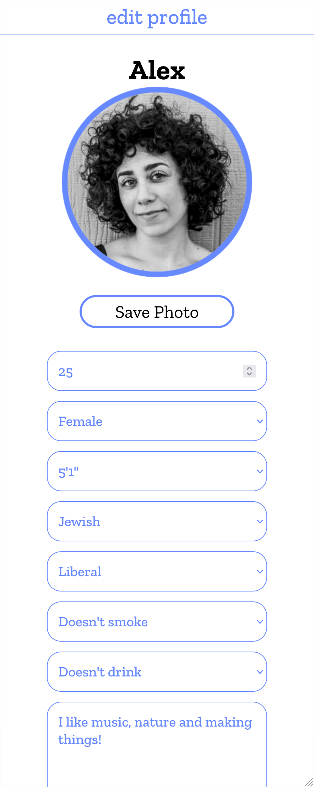
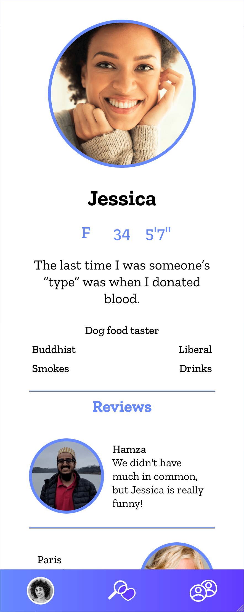
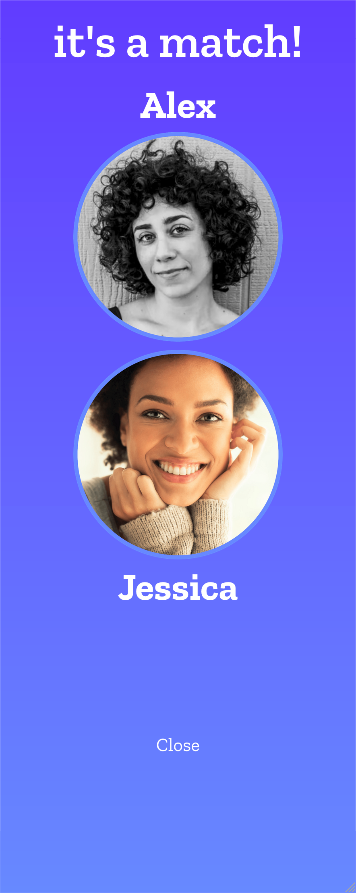
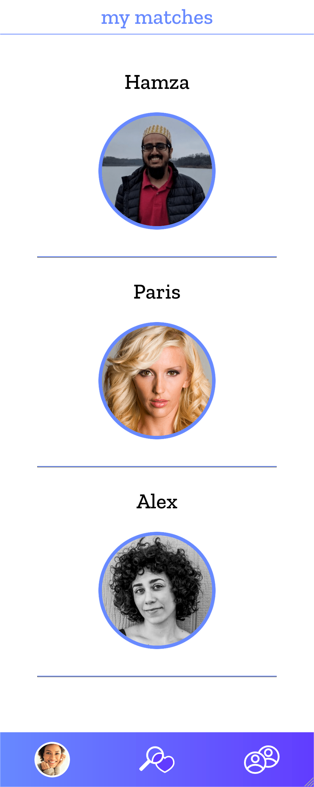

# Ghostbusters

## Description
An app which allows users to find potential matches and review their dates.

## Deployed App
[Ghostbusters](https://agile-peak-65135.herokuapp.com/)

Test username: alex@email.com
Password: 12345678
  
## Table of Contents
- [Screenshot](#screenshot)
- [Usage](#usage)
- [Contributing](#contributing)
- [License](#license)
  
## Screenshot

    

  
## Usage
Sign up with first name, email address, and password. Click the profile icon to choose a photo and Save Photo to upload it. Fill out all the fields for profile, hit next, then fill out the fields for preferences. Use the explore page, indicated by the middle icon on the purple bar, to view potential matches. Click the photo to see further details about the perso, including reviews about them. Decide whether or not to "like" the person by clicking the broken heart or heart. When you have a match, you can view them by clicking the rightmost button on the purple bar. You can click on the match to view their profile and add a review. View your own profile by clicking your photo in the purple bar. You can edit your profile and preferences or log out.
 
## Contributing
[Justin Watkins](https://github.com/JWatkins28), [Rashida Kapadia](https://github.com/rashida53), [Jenny Blacutt](https://github.com/itsjennyb), [Alex Berger](https://github.com/aberger3647)

## License
Learn more about [MIT](https://choosealicense.com/licenses/mit/).
